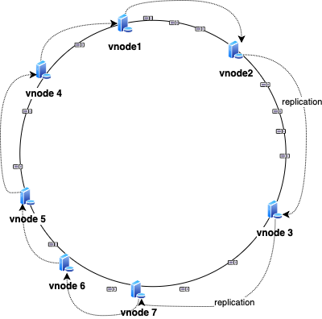
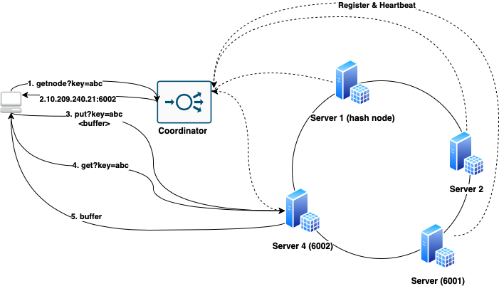

**Dependancies** <br />
Python 2.7 Linux environment
Sample Test results available under test.out

**Problem Statement:** <br />
Implement a distributed hash table. 

**Context:**  <br />
Hashtable is a data structure that holds key and value in memory. It allows fast O(1) lookups. It can be backed by persistent storage where it could keep recently used entries in a hashtable as cache. 

As data grows, the footprint of the hashtable within memory also grows. One can increase memory for the server; but eventually we will be constrained by cost & cache misses. 

We can distribute data among multiple machines. Each machine will hold a shard based on some hashing strategy. Clients can communicate with the co-ordinator (load balancer). Co-ordinator will act as a middleware between clients and servers (shards). 

Co-ordinator can use the following hash function while performing CRUD operations to find appropriate shard-server client should communicate with.  
```
shard_server = hash(key)%n
  n: number of shard-servers configured
```
Each shard server will have a local hashtable backed by a persistent local storage. 

As data grows; eventually shards will grow in size and we might have to add more shard servers to increase capacity.

But addition of a new server changes our earlier calculation to find the appropriate server. Hence; we will have to remap keys from existing shard-servers with each other as per new calculation. Remapping will be needed for nearly all keys. It is not cost effective and needs application downtime. 

**Proposed Solution:**  <br />
We can look at Consistent hashing strategy to solve issues mentioned earlier.
It says that whenever a hash table is resized (by adding a new/removing a server) and consistent hashing is used; only K/N keys need to be remapped as compared to traditional hashing where nearly all keys need to be remapped. K being the number of keys and N is the number of servers.  

Consider a circular array called a ring. Let's say this ring has 360 places. 
We can place servers on this ring using the following hash function.
```
ring_position = hash(server_identifire)%360
server_identifier can be IP:PORT (A socket backed service listing for connections on each server) 
Here co-ordinator is going to use the same hash function to calculate ring_position for the requested keys by clients. 
```
```
ring_position = hash(key)%360
```
We can look at the next server in the clockwise direction on the ring to identify which server client needs to communicate with. 

**Adding new server**  <br />
Here; when we add a new server to the ring. Only keys from the next server in the clockwise direction need remapping to the new server. 

**Removing existing server**  <br />
What happens when the server containing keys goes down? We can solve this problem by keeping copy of data on multiple servers. For each put request server can replicate that data to the next server in the clockwise direction. Now; if the server responsible for serving keys goes down; those can be found on the next server in the clockwise direction. 

<div style="text-align:center"></div>

**CAP theorem:**  <br />
There are two strategies to implement replication. 

* Synchronous replication: <br /> 
A write request will have to wait until data gets replicated to the successor and it is written to its own local storage as well as the primary server responsible for the key. 

* Asynchronous replication: <br /> 
Response for the request shall be returned immediately once data is written on the local storage of the responsible server. If replication fails; after storing data on local storage and responsible server goes down then we have a data loss. 

Choosing over synchronous vs asynchronous replication comes down tradeoffs. Synchronous replication (read/write in quorum) guarantees consistency over availability compared to asynchronous replication. 

The CAP theorem states that it is impossible for a distributed system to provide all three of the following guarantees. 

* Consistency - All nodes see the same data at the same time. Read/Write in quorum.   <br />
* Availability - A guarantee that every request receives a response.  <br />
* Partition tolerance - The system continues to operate despite arbitrary message loss or failure of part of the system.   <br />

It would depend on the application which two sides of above it prefers. Availability + Partition tolerance allows a low latency response with eventual consistency. 


**Server design: (Hash node)**  <br />
Server is responsible to maintain a hashtable for a particular shard. Once the server gets started it will register itself with the coordinator. It can uniquely identify itself using socket (IP:Port). It will also start a heartbeat thread responsible for telling coordinator it’s status and stats (eg. memory usage). 

Server will maintain an in-memory hashtable. 
Hashtable can be created using a chaining based approach. An array will be initialized where each bucket (index) will have a chain associated with it. 
```
 index = hash(key)%size
 // hash function should be uniformly distributed 
// index would be position in array
```
We can implement our own or can use standard uniform hashing algorithms like md5 (since cryptography related vulnerabilities is not the concern here) 

(key, value) shall be appended to the chain for respective hash index bucket. 

We can perform linear search over the chain for update/insert/search. We can also keep the chain in sorted manner to perform search in O(log n).

We also need to make sure that insert/search/deletes are thread safe. Hence each chain would be protected by a mutex. Enhancement would be to implement a read-writer lock to gain performance over exclusive locks.

The Initial phase for this service shall also be responsible for fetching keys which need a remap from the successor server before claiming healthy status. Also based on the replication strategy there can be more threads responsible for replicating key:val to successors. 

**API Specs:** <br />
```
Request (payload can be raw binary data as well)

POST http://localhost:6001/v1/put?key=name
{“name” : “abc”}

Response
{"key":"abc","msg":"Successfully inserted","result":0}
```
```
Request
GET http://localhost:6001/get?key=name

Response
{"key":"abc","result":0,"value":"{\t\"name\":\"abc\"}"}
```
```
Request (read iterator)
POST http://localhost:6001/put?key=alphas
“abcdefghijklmnopqrstuvwxyz” 

Response (for example; iterator over pages of size 4 bytes)
GET http://localhost:6001/get/page/0?key=alphas
{"key":"alphas","page":0,"result":0,"total_pages":7,"value":"abcd"}

GET http://localhost:6001/get/page/1?key=alphas
{"key":"alphas","page":1,"result":0,"total_pages":7,"value":"efgh"}
```
**Coordinator design: (COR node)** <br />
Coordinator is a server responsible for communicating with clients as well as servers. It allows server registrations. It maintains a ring (circular array). It keeps the status of each server by using the HB sent by them. It adds/removes servers using identifier's hash to or from this ring. 
It exposes an API for the client to get the appropriate server it should communicate with based on the key it is looking for (to insert/search/delete). 

**API Specs**
```
Request (Register node)
POST http://localhost:5000/register?identity=10.209.248.12:6001

Response
{"msg":"Registered Successfully","result":0}
```
```
Request
GET http://localhost:5000/getnode?key=abc

Response (find server for based on key)
{"node":"0.0.0.0:6002","result":0}
```
```
Request
GET http://localhost:5000/getallnodes

Response (places within ring)
{"result":0,"ring":"[2, 182, 245, 250, 318, 353]”
```
<div style="text-align:center"></div>

**first commit**
* Implemented a hash table with chaining.
* Implemented consistent hashing for load distribution. 
* Read with an iterator is available in case data is large. 
* All CRUD operations are thread safe. 
* There is a cap on memory used by individual servers. Tunable; default kept to 10 MB. Once memory is full it won’t allow any more insertions. 
* Communication between server-coordinators is using HTTP REST interface. Although a plain TCP socket could have been better. To reduce TCP handshake overhead; * session (keep-alive) is used wherever possible. 
* MD5 is used as a hash function as it is well known for uniform distribution. Cryptography is not the concern here. 
* Another approach for communication could be; client communicates with coordinator. Coordinator will have a TCP socket with servers and it will communicate on behalf of clients to get the response. 
* Multiple virtual nodes for each server on ring should minimise skews. Yet to implement it. 
* Added a testing script to validate consistency of data and CRUD operations. 


